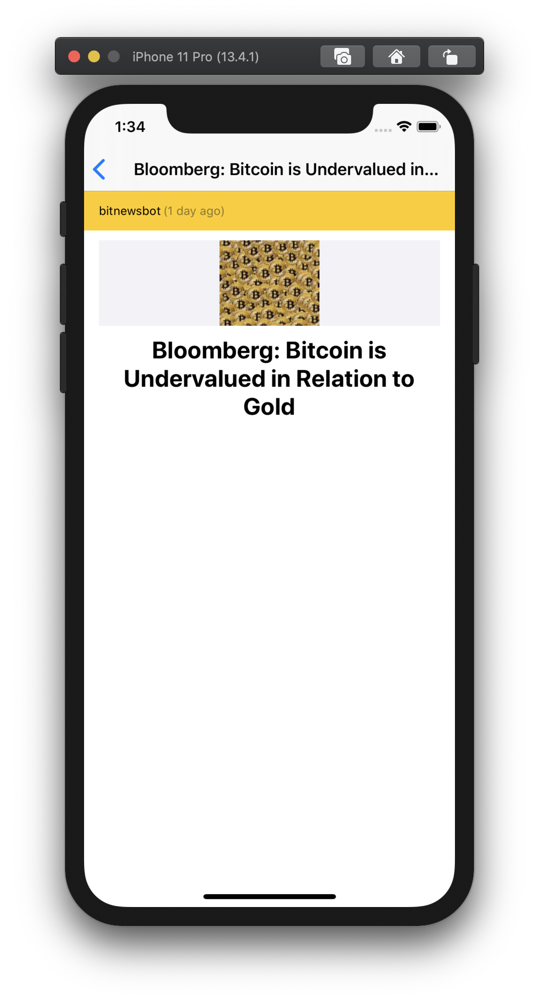

# Reddit Test

## MVVM-based Reddit test app for iOS (iPhone / iPad) in Swift

This project contains the codebase for an MVVM-based Reddit test app for iOS (iPhone / iPad) in Swift. It relies on RxSwift library to support data-bindings, and IoC with Dip. Also it implements a view-first navigation.

The structure of the project is as follow:

- UI Layer
  - iOS UI (Storyboards, Views/ViewControllers, and other UI components)

- Application Layer
  - ViewModels, CompositionRoot for Dip framework, and non platform-specific components
  
- Domain Layer
  - Services and models

- Infraestructure Layer
  - Network, Persistence, Extensions and Utils classes

## What can be improved

Overall I feel pretty good with the final results, but I know a lot of things can be improved considering the little amount of work I have invested into this challenge (1 day and a little more for polishing things)

Some of the things that can be improved:
- Didn't get time for implement saving pictures in the picture gallery. One possible implementation would be by using `UIImageWriteToSavedPhotosAlbum`.
- Didn't invested so much time to research Reddit API, so pagination implementation is not something I can be totally proud of.
- I should have made use of `UIStackView` in `PostViewCell` instead of manually / programmatically change constraints values.
- Didn't get time for implement full sized picture view for posts that have a picture besides a thumbnail.
- Didn't test on a lot of devices / simulators, so adding a `UIScrollView` in  Post Detail view would make me happier with the final results.
- Finally, I could have added some Unit Tests.

## What I like of the final results

I ended up with a simple but really nice looking app that complies with ~90% of the requirements of the challenge. While designing storyboards, I took in mind the Apple Human Interface Guidelines for iOS and that can be easily noticeable. Portrait and Landscape mode for iPhone and iPad works really good and smooth.

## Screenshots

